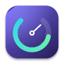
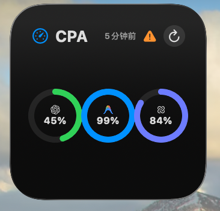
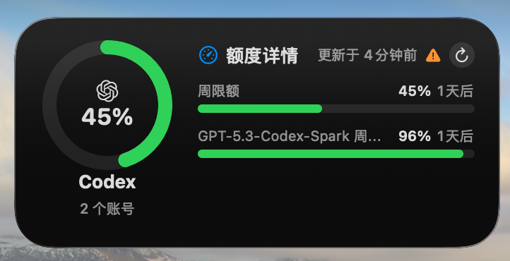

# CPA Widget — CLIProxyAPI Quota Monitor

<p align="center">
  
</p>

<p align="center">
  A native macOS app and desktop widget for monitoring CLIProxyAPI account quotas
</p>

<p align="center">
  <a href="README.md">简体中文</a> · <a href="README_EN.md">English</a>
</p>

<p align="center">
  
  
  
</p>

CPA Widget reads subscription quotas through the CLIProxyAPI Management API, shows each account's remaining percentage and reset windows, and brings the most useful information to the macOS menu bar and desktop. Codex is enabled by default; every other provider is optional.

> Current version: v0.5.5. Requires macOS 14 Sonoma or later.

## Screenshots

These are real Widget screenshots and contain no account identifiers.

| Small · provider overview | Medium · Codex quota details |
| --- | --- |
|  |  |

## Features

- Codex, Claude OAuth, Gemini CLI / Antigravity, and Kimi Code.
- English and Simplified Chinese UI; Simplified Chinese is the default.
- Per-credential quota cards without merging accounts.
- Provider overviews average the remaining quota across every account for that provider.
- Weekly, short-window, Codex Spark, and other quota windows returned by the backend.
- A quota timeline that compares quota used with time elapsed to reveal consumption pace.
- 5, 15, or 30-minute automatic refresh, plus manual refresh.
- A configurable menu-bar quota display with provider/account scope, primary and secondary windows, ten presets, and a custom composer.
- Dark Mode, SF Symbols, Dynamic Type, and native WidgetKit styling.
- Endpoint storage in App Group settings and Management Key storage in macOS Keychain.
- Provider OAuth tokens stay inside CLIProxyAPI and are never read or stored by this app.

## Widget layouts

### Quota widget

- Small: one provider ring, up to four provider-average rings, or up to four account rings.
- Medium: one provider average with two quota bars, up to four providers, or up to two account details.
- Large: a provider and its account details, or a 2×2 grid of up to four providers/accounts.

### Quota timeline widget

- Small: up to three accounts with one preferred quota window each.
- Medium: up to two account timelines.
- Large: up to three accounts with up to two real quota windows per account.
- Edit the Widget to choose providers, accounts, and short or weekly windows.

Widget refresh timing is ultimately controlled by macOS and may be delayed by sleep, power conditions, or system scheduling.

## Menu-bar quota

Turn on **Show** in the app's **Menu Bar Quota** section to keep quota information in the macOS menu bar:

- The default is the average weekly quota across all Codex accounts, with Spark available as the secondary quota.
- Choose all accounts, one provider, or specific accounts, then select the primary and secondary quota windows.
- Ten presets include icon only, icon with percentage, linear progress, dual quota, dual progress bars, two-line, and ring styles. A custom composer and live width preview are also available.
- Click the menu-bar item for the full account list, reset times, freshness, and error state. Refreshing from the panel does not open the main window.
- Closing the main window keeps the app running and refreshing at the configured interval.

## Installation

### Download a build

1. Download the latest build from [Releases](https://github.com/blackstone2333/CPA-Widget/releases).
2. Unzip it and move `CPA Widget.app` to `/Applications`.
3. Open the app and enter your CLIProxyAPI endpoint and Management Key.

Release builds currently use local signing and are not Apple-notarized. If macOS cannot verify the developer, run the following commands only after verifying that the app came from this repository:

```bash
sudo xattr -rd com.apple.quarantine "/Applications/CPA Widget.app"
open "/Applications/CPA Widget.app"
```

This removes the quarantine attribute only from CPA Widget; it does not disable Gatekeeper system-wide. Never run it on software from an untrusted source.

### Add a desktop Widget

1. Open CPA Widget, save the connection settings, and refresh all accounts once.
2. Right-click the desktop and select **Edit Widgets**.
3. Search for `CPA Widget`.
4. Add a Quota or Quota Timeline Widget in Small, Medium, or Large.
5. Right-click an added Widget and choose **Edit Widget** to select its layout, provider, accounts, and period.

If a Widget says “No quota data,” refresh once in the host app, then edit or remove and re-add the Widget.

## CLIProxyAPI configuration

The CLIProxyAPI Management API must be enabled. Example `config.yaml`:

```yaml
remote-management:
  allow-remote: false
  secret-key: "replace-with-a-strong-management-key"
```

- Keep `allow-remote: false` when both apps run on the same Mac.
- Enable remote management only when needed, and prefer HTTPS, a VPN, or a trusted tunnel.
- Enter the CLIProxyAPI root URL, for example `http://localhost:8317`. URLs ending in `/v0/management` are accepted too.
- Public HTTP sends the Management Key without transport encryption. CPA Widget warns about this but cannot secure the connection for you.

CPA Widget first reads:

```text
GET /v0/management/auth-files
```

It then asks CLIProxyAPI to make credential-scoped upstream calls through:

```text
POST /v0/management/api-call
```

CLIProxyAPI substitutes `$TOKEN$` on the server, so OAuth tokens are never sent to CPA Widget.

## Automatic refresh

- The host app fetches live quota, writes the shared local cache, and requests Widget reloads.
- When installed in `/Applications`, the app attempts to register itself as a login item.
- Closing the window keeps the app running, so automatic refresh can continue.
- Choosing **Quit CPA Widget** stops live fetching until the app is opened again.
- Sleep, power-saving policies, and network outages affect timing; an exact five-minute wall-clock guarantee is not possible.

## Build from source

Requirements: macOS 14+, Xcode 15.3+, Swift 5.9+, and [XcodeGen](https://github.com/yonaskolb/XcodeGen).

```bash
brew install xcodegen
git clone https://github.com/blackstone2333/CPA-Widget.git
cd CPA-Widget
xcodegen generate
xcodebuild \
  -project CPAWidget.xcodeproj \
  -scheme CPAWidget \
  -configuration Release \
  -destination 'platform=macOS' \
  -derivedDataPath build/DerivedData \
  ARCHS='arm64 x86_64' \
  ONLY_ACTIVE_ARCH=NO \
  build
```

If the command line reports that no signing identity is available, select your own Team under Signing & Capabilities in Xcode and build again.

The app will be located at:

```text
build/DerivedData/Build/Products/Release/CPA Widget.app
```

Alternatively, open `CPAWidget.xcodeproj` in Xcode and run the `CPAWidget` scheme.

## Privacy and security

- The Endpoint is stored in App Group settings. The Management Key stays in macOS Keychain and is written only when it changes.
- Quota snapshots, account display labels, and non-sensitive preferences stay locally in `~/Library/Application Support/CPAWidget/Shared/`.
- OAuth tokens, CLIProxyAPI credential files, and account secrets are never committed to this repository or exported by the app.
- The project contains no telemetry, advertising, cloud sync, or third-party analytics SDK.
- Remote HTTP is insecure. Use HTTPS across networks and rotate Management Keys regularly.

See [SECURITY.md](SECURITY.md) for vulnerability reporting. Never paste secrets, tokens, private endpoints, or account details into a public issue.

## Project structure

```text
App/         macOS host app and settings UI
Widget/      WidgetKit Extension, layouts, and App Intent configuration
Core/        Shared models, protocols, and views
Providers/   CLIProxyAPI provider adapters and response parsing
Services/    Quota orchestration and automatic refresh
Storage/     Keychain, settings, and shared cache
Resources/   App icon and provider logos
```

Provider subscription quota endpoints are not stable public APIs. Keep response-specific changes inside the relevant adapter whenever possible. Logo sources are documented in [Resources/PROVIDER_LOGO_SOURCES.md](Resources/PROVIDER_LOGO_SOURCES.md). Provider names and marks belong to their respective owners; this project is not affiliated with or endorsed by them.

Read [CONTRIBUTING.md](CONTRIBUTING.md) before contributing.

## Related projects

- [CLIProxyAPI](https://github.com/router-for-me/CLIProxyAPI) — the backend and Management API used by CPA Widget.
- [CLIProxy Pool Watch](https://github.com/murasame612/CLIProxyPoolWidget) — native WidgetKit and multi-account pool reference.
- [CLIProxyAPI Quota Inspector](https://github.com/AllenReder/CLIProxyAPI-Quota-Inspector) — Management API, account-index, and parser reference.
- [ZeroLimit](https://github.com/0xtbug/zero-limit) — multi-provider quota parsing reference.
- [AIUsage](https://github.com/sylearn/AIUsage) — Swift provider boundaries and conservative Gemini aggregation reference.
- [Quotio](https://github.com/nguyenphutrong/quotio) — native macOS quota UI and response-model reference.

## License

Source code is available under the [MIT License](LICENSE). Provider logos and trademarks remain the property of their respective owners.
